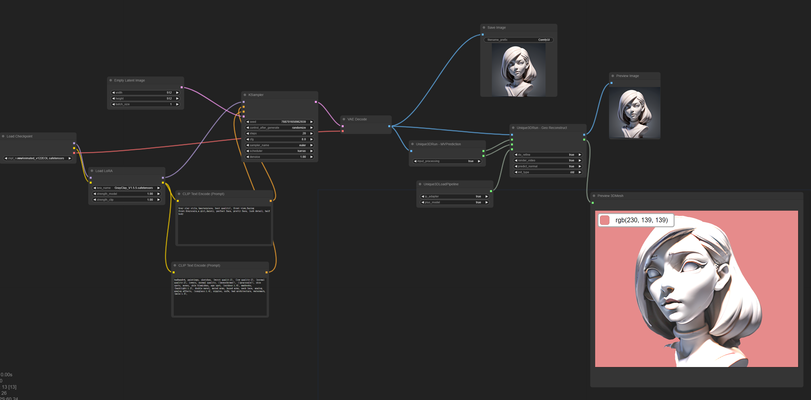

# ComfyUI Unique3D

**ComfyUI Unique3D** is custom nodes that running [AiuniAI/Unique3D](https://github.com/AiuniAI/Unique3D) into ComfyUI


**!!It is highly recommend that downloads a new ComfyUI bundle to try this!!**

## (Windows) VS Build Tool- Setup 
It might require Visual Studio Build Tools. However, I am not sure because my local already installed previously. If it needs, you can find from [Visual Studio Build Tools](https://visualstudio.microsoft.com/downloads/?q=build+tools).

## ComfyUI 3D Pack - Setup
1. git clone https://github.com/MrForExample/ComfyUI-3D-Pack.git in custom_notes folder
2. run install_windows_portable_win_py311_cu121.bat inside ComfyUI-3D-Pack
3. run ComfyUI (run_nvidia_gpu.bat) to check 3D-Pack installed successfully.
   1. (On my local, it has error) pytorch3d import _C - ImportError: DLL load failed while importing _C: 找不到指定的程序
      1. {comfyUI_python_embeded}\python.exe -m pip uninstall pytorch3d
      2. {comfyUI_python_embeded}\python.exe -m pip install git+https://github.com/facebookresearch/pytorch3d.git@stable
   2. (On my local, it has error) python.exe 无法找到入口，_catter_cuda.pyd
      1. {comfyUI_python_embeded}\python.exe -m pip uninstall torch_scatter
      2. {comfyUI_python_embeded}\python.exe -m pip install torch_scatter
   3. run ComfyUI to check again.

please refer [ComfyUI-3D-Pack](https://github.com/MrForExample/ComfyUI-3D-Pack) for more details

## ComfyUI Unique3D - Setup
1. git clone https://github.com/jtydhr88/ComfyUI-Unique3D.git in custom_notes folder
2. (Windows) Download the trition whl from https://huggingface.co/madbuda/triton-windows-builds, because it uses python 311, so download whl build for py311 and place it under ComfyUI-Unique3D folder.
3. (Windows) run install_windows_portable_win_py311_cu121.bat inside ComfyUI-Unique3D
   1. answer Y while asking remove something
4. Download the weights from [huggingface spaces](https://huggingface.co/spaces/Wuvin/Unique3D/tree/main/ckpt) or [Tsinghua Cloud Drive](https://cloud.tsinghua.edu.cn/d/319762ec478d46c8bdf7/), and extract it to `ckpt/*`.
```
ComfyUI-Unique3D
    ├──ckpt
        ├── controlnet-tile/
        ├── image2normal/
        ├── img2mvimg/
        ├── realesrgan-x4.onnx
        └── v1-inference.yaml
```

## Runtime ##
1. The output folder is your **ComfyUI/output/Unique3D/**
2. You might see the error of onnxruntime, but it would not affect the generation of the mesh (maybe?)
   1. If you want to fix this the TensorRT error, you need to download TensorRT bundle for windows from https://github.com/NVIDIA/TensorRT, and configure TensorRT-10.0.1.6\lib in your PATH env variable. meanwhile it also needs to configure CUDA and cuDNN, please refer to github page for more details.

## Workflow ##
I provided one example workflow, see [example-workflow1](workflow/example-workflow1.json)

Another workflow I provided - [example-workflow2](docs/example-workflow2.json), generate 3D mesh from ComfyUI generated image, it requires:
1. Main checkpoint - [ReV Animated](https://civitai.com/models/7371/rev-animated)
2. Lora - [Clay Render Style](https://civitai.com/models/108464/clay-render-style)

It will generate gypsum style 3D model: 
 

## Node Explain ##
Currently, it has three custom nodes.

### Unique3DLoadPipeline
TODO

### Unique3DRun - MVPrediction
TODO

### Unique3DRun - Geo Reconstruct
TODO

## Credit
- [AiuniAI/Unique3D](https://github.com/AiuniAI/Unique3D) - High-Quality and Efficient 3D Mesh Generation from a Single Image
- [ComfyUI](https://github.com/comfyanonymous/ComfyUI) - A powerful and modular stable diffusion GUI.
- [ComfyUI-3D-Pack](https://github.com/MrForExample/ComfyUI-3D-Pack) - An extensive node suite that enables ComfyUI to process 3D inputs (Mesh & UV Texture, etc) using cutting edge algorithms (3DGS, NeRF, etc.)

## My extensions for ComfyUI
- [ComfyUI-Unique3D](https://github.com/jtydhr88/ComfyUI-Unique3D) - ComfyUI Unique3D is custom nodes that running Unique3D into ComfyUI
- [ComfyUI-LayerDivider](https://github.com/jtydhr88/ComfyUI-LayerDivider) - ComfyUI InstantMesh is custom nodes that generating layered psd files inside ComfyUI
- [ComfyUI-InstantMesh](https://github.com/jtydhr88/ComfyUI-InstantMesh) - ComfyUI InstantMesh is custom nodes that running InstantMesh into ComfyUI
- [ComfyUI-ImageMagick](https://github.com/jtydhr88/ComfyUI-ImageMagick) - This extension implements custom nodes that integreated ImageMagick into ComfyUI
- [ComfyUI-Workflow-Encrypt](https://github.com/jtydhr88/ComfyUI-Workflow-Encrypt) - Encrypt your comfyui workflow with key

## My extensions for stable diffusion webui
- [3D Model/pose loader](https://github.com/jtydhr88/sd-3dmodel-loader) A custom extension for AUTOMATIC1111/stable-diffusion-webui that allows you to load your local 3D model/animation inside webui, or edit pose as well, then send screenshot to txt2img or img2img as your ControlNet's reference image.
- [Canvas Editor](https://github.com/jtydhr88/sd-canvas-editor) A custom extension for AUTOMATIC1111/stable-diffusion-webui that integrated a full capability canvas editor which you can use layer, text, image, elements and so on, then send to ControlNet, basing on Polotno.
- [StableStudio Adapter](https://github.com/jtydhr88/sd-webui-StableStudio) A custom extension for AUTOMATIC1111/stable-diffusion-webui to extend rest APIs to do some local operations, using in StableStudio.
- [Txt/Img to 3D Model](https://github.com/jtydhr88/sd-webui-txt-img-to-3d-model) A custom extension for sd-webui that allow you to generate 3D model from txt or image, basing on OpenAI Shap-E.
- [3D Editor](https://github.com/jtydhr88/sd-webui-3d-editor) A custom extension for sd-webui that with 3D modeling features (add/edit basic elements, load your custom model, modify scene and so on), then send screenshot to txt2img or img2img as your ControlNet's reference image, basing on ThreeJS editor.
